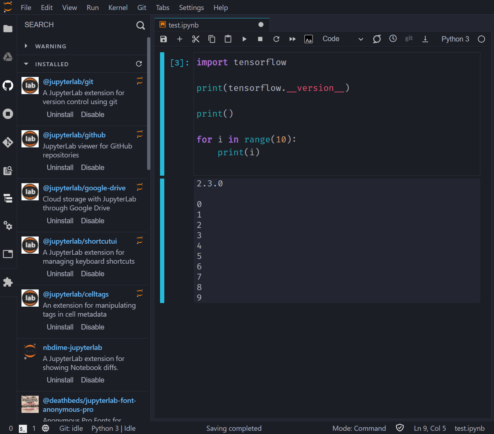

# Deepo JupyterLAB

deepo 이미지에 jupyter-lab extension을 설치하는 dockerfile이다.

> ## [Deepo Github](https://github.com/ufoym/deepo)

## 설치 방법

```shell
cd <다운로드 받은 디렉토리>
docker build -t <your name>/deepo_jupyterlab:1.0 .
```

## 컨테이너 실행

```shell
docker container run -itd -p 8889:8889 --name=[컨테이너명] -v <공유데이터 경로>:/data -v <공유속성 경로>:/config --ipc=host <이미지명>

ex) docker container run -itd -p 8889:8889 --name=deepo -v ~/Documents/deepo/data:/data -v ~/Documents/deepo/config:/config --ipc=host seongcheoljeon/deepo_jupyterlab:1.0
```



```shell
http://localhost:8889
```

---

### 테마 변경

Settings - JupyterLab Theme - JupyterLab Horizon

## 설치되는 extentions

- git
- github
- google-drive
- shortcut gui
- cell tags
- nbdime
- font
  - anonymouse-pro
  - dejavu-sans-mono
  - fira code
- file tree
- vim
- theme
  - dracula
  - horizon
  - material darker
- bytecode
- go to definition
- code dormatter
- output auto scroll
